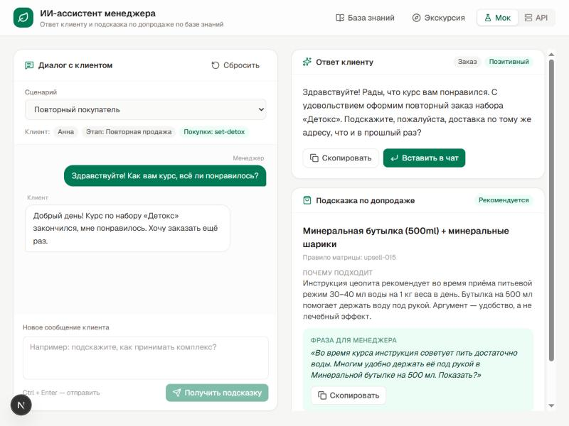
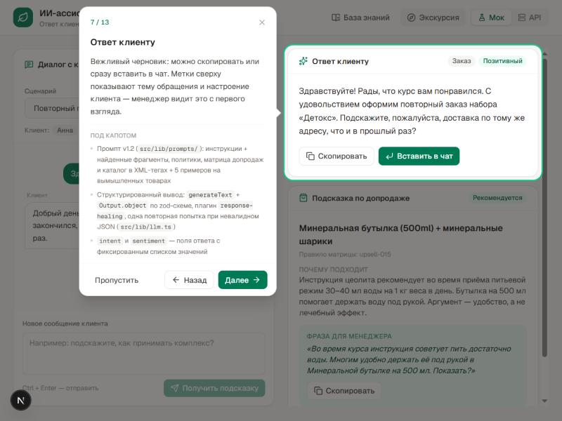
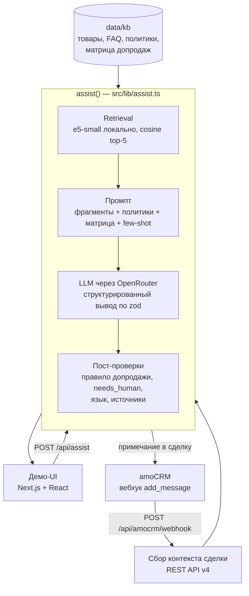

# ИИ-ассистент менеджера O-complex

Сервис для менеджеров интернет-магазина [O-complex](https://o-complex.com) (продукты для здоровья и бережного очищения организма). На обращение клиента он выдаёт два результата:

1. **черновик ответа клиенту** — вежливый, только по фактам из базы знаний, без медицинских обещаний;
2. **подсказку менеджеру по допродаже** — только по заранее утверждённым правилам и только когда она уместна.

Работает как демо-страница и как интеграция с amoCRM: вебхук на новое сообщение → черновик и подсказка примечанием в карточку сделки.

> Тестовое задание. Проект целиком собран командой ИИ-агентов в Claude Code под руководством человека-тимлида — см. [«Как это сделано»](#как-это-сделано-команда-агентов-в-claude-code).



## Возможности

- **RAG по реальной базе.** База собрана с o-complex.com: 15 товаров и наборов, 16 FAQ, политики доставки, оплаты и возврата, 49 фрагментов для поиска. Эмбеддинги считаются локально, внешний API не нужен.
- **Структурированный ответ.** Модель возвращает JSON по zod-схеме: ответ, intent, тон клиента, `needs_human`, источники, допродажа. Один контракт на фронт, бэк, amoCRM и eval: [`src/lib/contracts.ts`](src/lib/contracts.ts).
- **Допродажа под контролем кода.** Модель только выбирает правило из [матрицы допродаж](data/kb/upsell-matrix.json), а код проверяет его целиком: триггер, тип обращения, исключения (жалоба, негатив, вопрос о здоровье, несовершеннолетний), не куплен ли товар раньше. Тексты подсказки берутся из матрицы, а не пишутся моделью.
- **Безопасность в медицинском домене.** Беременность, дети, болезни и лекарства, жалобы, ответ не на языке клиента — всегда передаются человеку, даже если модель этого не отметила. Данные клиента экранируются против prompt injection.
- **amoCRM.** Вебхук `add_message` отвечает 200 сразу, обработка идёт в `after()`. Контекст сделки (контакт, этап, покупки, переписка) читается через REST API v4, результат пишется примечанием. Есть mock-режим на фикстурах из документации amoCRM.
- **Eval.** 20 тестовых обращений: беременность, дети, жалобы, prompt injection, английский язык, нейтральность по роду и др. Автопроверки + LLM-судья по рубрике.
- **Экскурсия по интерфейсу.** Пошаговый тур: простым языком — что видит менеджер, отдельным блоком «Под капотом» — как это устроено.



## Архитектура



| Слой | Решение |
|---|---|
| Фреймворк | Next.js 16 (App Router), TypeScript strict, React 19, Tailwind 4 |
| LLM | Vercel AI SDK v7 (`generateText` + `Output.object`), [OpenRouter](https://openrouter.ai): бесплатная `nvidia/nemotron-3-super-120b-a12b:free` с запасными моделями, провайдер меняется через env |
| Эмбеддинги | `@huggingface/transformers` + `Xenova/multilingual-e5-small` (384, q8), локально |
| Поиск | косинусная близость в памяти: база маленькая, векторная БД не нужна |
| Валидация | zod 4 — одна схема даёт и типы, и проверку в рантайме |
| CRM | amoCRM REST API v4 через `fetch`, без SDK |

Почему выбрано именно так — в [`docs/decisions.md`](docs/decisions.md).

## Качество

Прогон eval-набора ([`data/eval/cases.json`](data/eval/cases.json), отчёт — [`docs/eval-report.md`](docs/eval-report.md)):

| Проверка | Промпт v1.1 | Промпт v1.2 |
|---|---|---|
| Учебные факты из примеров в реальных ответах | 5 из 18 | 0 |
| `needs_human` совпал с эталоном | 92% | 100% |
| Допродажа вставлена в ответ клиенту | 1 из 18 | 0 |
| Все автопроверки кейса | 72% | 67%¹ |

¹ Из 6 непрошедших кейсов v1.2: в одном оборвалась сеть, в двух шаблон проверки сработал на правильном отказе («не можем утверждать, что вылечит»); проверки с тех пор исправлены. Настоящие ошибки — ответ по-английски русскому клиенту, допродажа после отказа клиента, повторное приветствие.

После v1.2 правки проверялись точечными прогонами на кейсах, которых они касались (лимит бесплатной модели — 50 запросов в день). Промпт v1.5: допродажа после отказа отключается кодом, язык ответа верный во всех трёх кейсах, где модель ошибалась, после правила v1.4 родовых форм нет в 7 проверенных русских ответах. Открыто: повторное приветствие в начатом диалоге. Подробности и размеры выборок — в [`docs/eval-report.md`](docs/eval-report.md).

## Как это сделано: команда агентов в Claude Code

Проект собран в [Claude Code](https://claude.com/claude-code). Человек — тимлид: ставит задачи, принимает решения и проверяет результат; код, база, промпты и тесты написаны агентами.

- **8 ролей-субагентов** с зонами ответственности по файлам: [`.claude/agents/`](.claude/agents) — kb-builder, prompt-engineer, backend-dev, amocrm-integrator, frontend-dev, qa-evaluator, demo-producer, interview-coach.
- **Волны.** Волна 0 — каркас и контракты; волна 1 — пять агентов параллельно, каждый в своём `git worktree` и своей ветке `feat/*`; затем слияние, интеграция и eval. Промпты волн — [`prompts/`](prompts).
- **Контракты как точка синхронизации.** Параллельные агенты не видят работу друг друга, поэтому схема ответа и формат базы зафиксированы заранее. Изменить контракт агент не может, только предложить: [`docs/contract-changes.md`](docs/contract-changes.md).
- **Журнал ошибок ИИ.** Каждый агент после задачи пишет, где ошибся и как это поймали: [`docs/ai-log.md`](docs/ai-log.md). Несколько примеров:
  - выбранный по обзорам бесплатный сервис моделей оказался закрыт — поймано по официальной документации до того, как на него перевели код;
  - `generateObject` в AI SDK v7 помечен устаревшим — найдено по документации внутри установленного пакета;
  - живой прогон показал, что подсказка по допродаже бралась из чужого правила матрицы — исправлено проверкой правила целиком;
  - eval показал, что модель переносит противопоказания вымышленного товара из few-shot в реальные ответы — примеры переписаны, валидатор теперь запрещает реальные названия в учебных примерах.

## Запуск

Нужен Node.js 22.

```bash
npm install
cp .env.example .env.local   # вписать OPENROUTER_API_KEY (бесплатно, без карты)
npm run build-index          # эмбеддинги базы в data/kb/index.json, ~10 с
npm run dev
```

Откройте http://localhost:3000. Режим **«Мок»** работает без ключа, режим **«API»** обращается к модели. Экскурсия запускается кнопкой «Экскурсия» или по `?tour=1`.

> Если выход в интернет идёт через прокси или VPN: Node `fetch` по умолчанию прокси игнорирует, системный прокси Windows тоже. Впишите адрес прокси в `.env.local` (`HTTPS_PROXY`, `HTTP_PROXY`, `NO_PROXY`, см. `.env.example`) и запускайте `npm run dev:proxy` или `npm run start:proxy`; `npm run eval` делает так же.

| Команда | Что делает |
|---|---|
| `npm run dev` | демо-UI и API |
| `npm run build-index` | пересчитать эмбеддинги базы |
| `npm run eval` | прогнать eval-набор (флаги: `--only`, `--no-judge`, `--baseline` и др. — в шапке [`scripts/eval.ts`](scripts/eval.ts)) |
| `npx tsx data/eval/validate.ts` | проверить eval-набор и few-shot без вызова модели |
| `npx tsx scripts/amocrm-mock-webhook.ts` | отправить фикстуру вебхука amoCRM на локальный сервер (`AMOCRM_MODE=mock`) |
| `npm run typecheck` / `npm run lint` | проверки |

Подключение к живому amoCRM — [`docs/amocrm-setup.md`](docs/amocrm-setup.md).

## Структура

```
data/kb/          база знаний: товары, FAQ, политики, матрица допродаж, фрагменты для поиска
data/eval/        тестовые обращения, схема и валидатор
data/amocrm-mock/ фикстуры amoCRM по документации API v4
src/lib/          контракты, retrieval, LLM-слой, промпты, ядро assist(), amoCRM
src/app/api/      /api/assist, /api/amocrm/webhook
src/components/   демо-интерфейс и экскурсия
scripts/          сборка индекса, eval, mock-вебхук
docs/             решения, журнал ИИ, отчёт eval, настройка amoCRM
.claude/agents/   роли команды агентов
prompts/          промпты волн
```

## Ограничения

- Бесплатные модели OpenRouter: 50 запросов в день на аккаунт и ответ 10–30 с. Для продакшена — платная модель того же семейства (ориентировочно $1–4 на 1000 обращений по ценам OpenRouter).
- Факты, которые не удалось подтвердить на сайте, помечены в базе `TODO: проверить` и клиенту как подтверждённые не сообщаются.
- Живой режим amoCRM проверен только на фикстурах из документации, без реального аккаунта.

Данные о товарах взяты с официального сайта o-complex.com для тестового задания.
