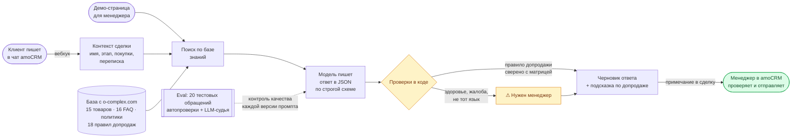

# Схема для слайда (0:00–0:04)

Слайд показывает путь обращения и места, где код страхует модель. Технологии на схеме упомянуты минимально: слайд про то, как устроено решение и где стоит контроль качества.

Отрисовать можно в [mermaid.live](https://mermaid.live) (экспорт PNG/SVG, тема `default` или `neutral`, 1920×1080) или прямо на GitHub: файл отображается как диаграмма.

## Вариант для слайда (горизонтальный, 16:9)

## Подписи к слайду (если нужна строка текста под схемой)

> Модель пишет, код проверяет, отправляет человек.

## Что на схеме и откуда это

| Элемент | Источник |
|---|---|
| 15 товаров, 16 FAQ, 18 правил допродаж | `docs/ai-log.md`, запись kb-builder; окно «База знаний» (15 / 16 / 6 / 18) |
| Вебхук → контекст сделки → примечание | `docs/amocrm-setup.md`; проверено в mock-режиме на фикстурах из документации amoCRM, живой аккаунт не подключался |
| Проверки в коде: правило допродажи, `needs_human` по здоровью, жалобе и языку | `src/lib/assist.ts` (`checkUpsell`, `postProcess`), шаги 8 и 12 экскурсии |
| Eval: 20 обращений | `data/eval/cases.json` (20 кейсов после v1.3, см. `docs/ai-log.md`, запись prompt-engineer 2026-10-01) |

Подробная вертикальная схема с файлами и библиотеками есть в README, раздел «Архитектура». Для слайда она слишком мелкая.
